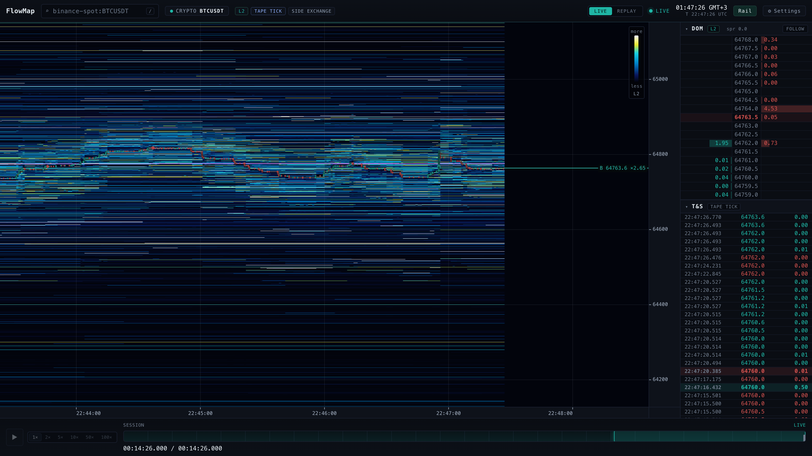
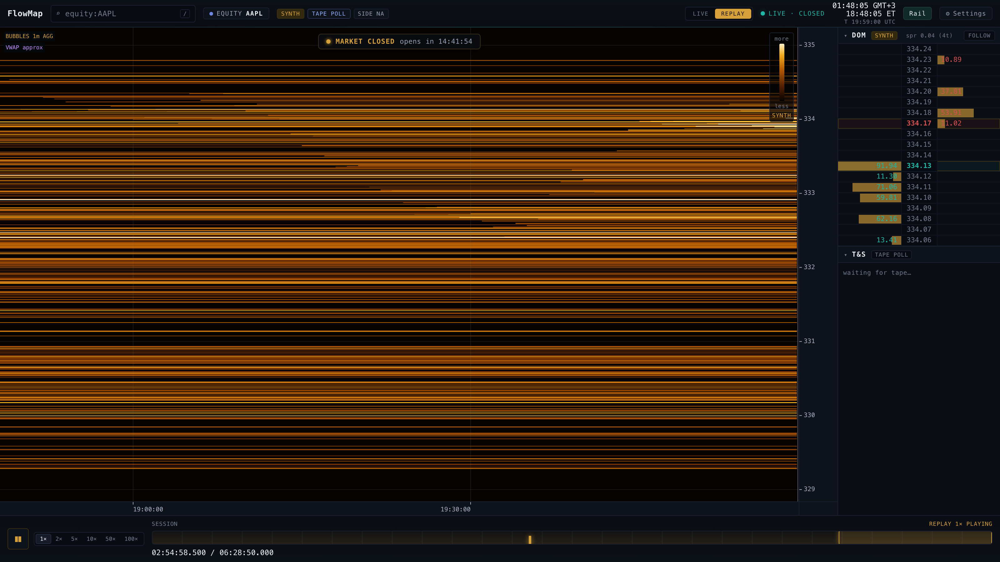
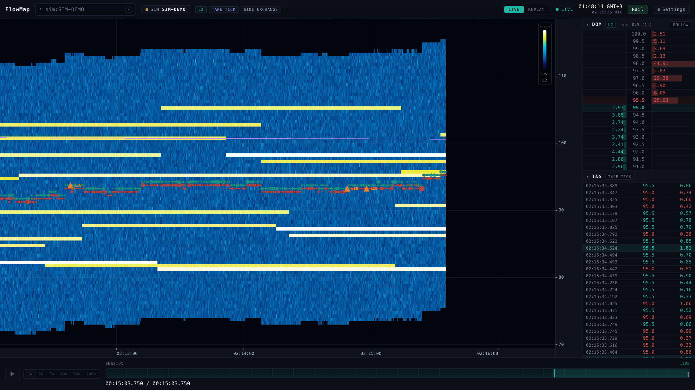
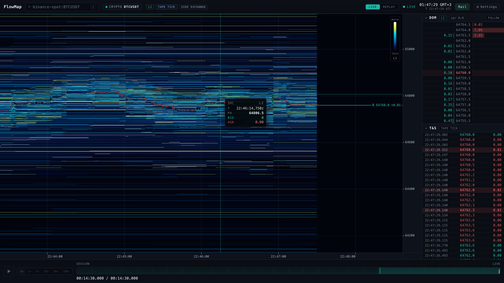
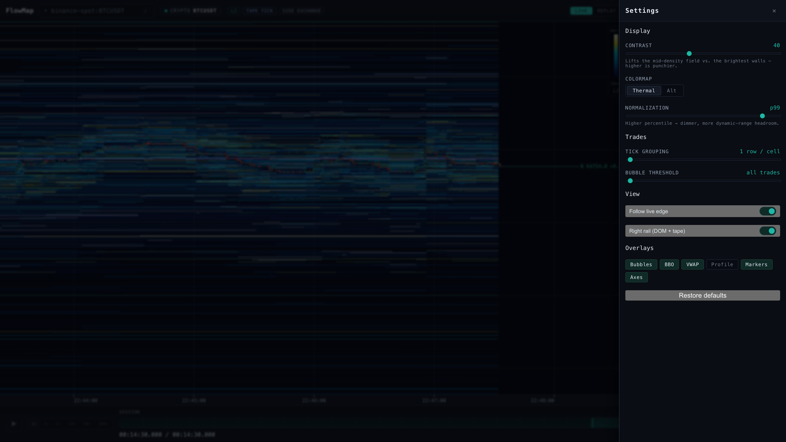

# FlowMap

**An institutional-grade, dual-market order-flow visualizer — real-time liquidity heatmap, DOM
ladder, time & sales, and order-flow overlays for crypto and US equities, in one renderer.**


<sub>Live `binance-spot:BTCUSDT` — WebGL2 liquidity heatmap, DOM ladder, and tick tape, ~15 minutes
into a session. Columns are rasterized once on the GPU, so pan/zoom cost never grows with history.</sub>

FlowMap is a ground-up rebuild of an earlier PyQt6 desktop app that re-rasterized the entire visible
history on the CPU every pan/zoom frame, so scrolling back through history collapsed to ~1 fps.
FlowMap puts history in a WebGL2 texture and makes pan/zoom a pure view transform — **interaction cost
is independent of history depth**. It unifies two market-data engines
([Crypcodile](https://github.com/nazmiefearmutcu/Crypcodile) for crypto,
stockodile for US equities) behind one market-agnostic renderer.

## Highlights

- **60 fps pan/zoom at any history depth.** A column, once uploaded to the GPU, is never
  re-rasterized; pan and both zoom axes only change a uniform. Measured: draw cost is ~0.2 ms
  whether 200 or 10 000 columns are resident (history-independent — the old 1-fps bug is
  structurally gone).
- **Professional order flow:** liquidity heatmap (inferno ramp — indigo → red → gold → white, so
  relative size reads by hue and not just brightness — with correct SUM-mip zoom-out so walls
  don't dilute), DOM ladder, time & sales tape, prominent trade bubbles, a bright **last-price
  line** that persists as far back as the book, BBO, VWAP, a **CVD** (cumulative volume delta)
  lower pane locked to the chart's time axis, volume profile, event markers, crosshair with exact
  liquidity readout, deep scroll-back, replay transport. Every overlay toggles individually.
- **Chart controls that behave like the tools you already use.** The price gutter is a control
  surface: wheel scales price at the cursor, a vertical drag scales the axis, double-click
  re-fits. The two axes follow independently — scroll back through time and price keeps
  auto-scaling; zoom price and the right edge stays pinned to now, with your zoom preserved and
  the window recentring only when price leaves a central deadband. Re-arming price-follow **keeps
  your zoom** (it never re-frames the book out from under you); an in-chart **Go Live / Track
  Price** pill appears the moment you scroll off the live edge. Price and time both zoom out far
  past the grid, so nothing hits an artificial wall. A **Tolerance** black point (calibrated with a
  sensible non-zero default) hides sub-threshold density so only liquidity worth reading paints.
- **A command palette for the whole market.** Press **⌘K / Ctrl-K** (or `/`) for a centre-screen
  search over every crypto + equity symbol both engines reach — fuzzy-ranked, with the day's top
  movers, live price, % change and a mini sparkline, and honest capability chips per row. On first
  launch you choose from the settings how much history to pull straight onto the chart.
- **Configurable price coverage, including one that does not compromise.** On a linear grid range
  and resolution are the same knob: `native` keeps the finest rows, `±50%` and `−100%/+1000%`
  trade resolution for reach, and the widest of those is a range **scan** mode. **`Deep`** breaks
  the tie with a piecewise scale — a linear core at the instrument's native tick, wrapped in
  logarithmic wings. On BTC at $60k that is **±0.853% at $0.50/row — the exact ladder the narrow
  grid gives — plus coverage to −99%/+1000% at ~0.34%/row**. `Deep` is now the **default**, so
  price zooms out to the full range out of the box; `native` (finest rows, narrowest coverage) is
  one click away in the drawer.
- **Two markets, one renderer, honest tiers:** crypto shows full L2 depth + tick tape; US equities
  show what their free data actually supports — a keyless **two-sided** volume-at-price SYNTH depth
  (Yahoo 1 m bars, bid below / ask above a reference price that tracks the market) that upgrades to
  real Alpaca IEX L1 top-of-book with zero code change when `ALPACA_API_KEY`/`SECRET` are set.
  Synthetic depth renders in a distinct amber ramp and carries a `SYNTH` badge — capability badges
  (`L2` / `L1` / `SYNTH`, `TAPE TICK` / `TAPE POLL`, `SIDE EXCHANGE` / `SIDE NA`) are always honest,
  no fabricated depth.

## Screenshots

| | |
|---|---|
|  <br><sub>`equity:AAPL` on the keyless SYNTH tier, replaying a recorded market-hours session — distinct amber ramp, honest `SYNTH` / `TAPE POLL` badges, market-closed banner, synthetic book in the DOM.</sub> |  <br><sub>`sim:SIM-DEMO` deterministic feed — liquidity walls, buy/sell trade bubbles, VWAP line, and `LIQ` liquidation event markers.</sub> |
|  <br><sub>Crosshair with the exact per-cell readout: source tier, column timestamp, price, and resting bid/ask liquidity.</sub> |  <br><sub>The display pipeline is live: contrast (gamma), colormap, tolerance (black point), normalization percentile, tick grouping, bubble threshold, price range, both follow axes, and per-overlay toggles.</sub> |

## Architecture

```
client/   TypeScript + React + WebGL2 renderer (Vite)
          heatmap tile-array + SUM-mips + camera + overlays + DOM/tape + UI shell
server/   Python 3.13 asyncio gateway (FastAPI, binary WebSocket, loopback-only)
          time-weighted density grid + sessions + parquet recording/replay
          feeds/  crypto (Crypcodile) · equity (stockodile) · deterministic sim
```

The client is a pure renderer of a canonical binary stream (`docs/superpowers/specs/`); the server
normalizes every market into that stream + a capability descriptor. See
`docs/superpowers/plans/m1-verification.md`, `m2-verification.md`, `m3-verification.md` for the
verification record (live Binance + live equity evidence, perf gates, parity matrix).

## Install

Every installer on the [latest release](https://github.com/nazmiefearmutcu/flowmap/releases/latest)
is **fully self-contained** — it bundles the WebGL2 client *and* a relocatable Python 3.13 running
the server, so there is nothing else to install (no Python, no Node, no `uv`). Pick your platform:

| Platform | Download | Install |
|---|---|---|
| **macOS — Apple Silicon** | `FlowMap_1.2.0_aarch64.dmg` | open the dmg, drag **FlowMap.app** to Applications |
| **macOS — Intel** | `FlowMap_1.2.0_x86_64.dmg` | same as above |
| **Windows x64** | `FlowMap_1.2.0_x64-setup.exe` (NSIS) or `FlowMap_1.2.0_x64_en-US.msi` (MSI) | run the installer |
| **Linux x64** | `FlowMap_1.2.0_amd64.AppImage` (portable) or `flowmap_1.2.0_amd64.deb` (Debian/Ubuntu) | `chmod +x` the AppImage, or `sudo apt install ./flowmap_1.2.0_amd64.deb` |

> **First launch — unsigned app warnings.** The apps are **ad-hoc / unsigned and not notarized**
> (code-signing certificates for a paid Apple Developer ID / Windows publisher are not available for
> this project), so the OS will warn on first open:
> - **macOS:** **right-click → Open** (confirm once), or run `xattr -cr /Applications/FlowMap.app`.
> - **Windows:** SmartScreen → **More info → Run anyway**.
> - **Linux:** the AppImage needs `libwebkit2gtk-4.1`, `libgtk-3` and `libayatana-appindicator3`
>   present (the `.deb` declares these as dependencies and pulls them in automatically).
>
> After the first confirmation the app launches normally.

Installers are produced per OS+arch on CI (native Python wheels can't be cross-built). Any platform
without a prebuilt installer — including Linux on arm — can **run from source** (below).

## Run it

Prereqs: Python 3.13 + [uv](https://docs.astral.sh/uv/), Node 22 + npm.

```bash
./scripts/dev.sh          # boots the server (:8720) + the client dev server (:5173)
# then open http://localhost:5173
```

Or manually:

```bash
# terminal 1 — server
cd server && uv sync && FLOWMAP_PORT=8720 uv run python -m flowmap_server
# terminal 2 — client
cd client && npm install && npm run dev
```

In the top-bar symbol search: pick `SIM-DEMO` (deterministic demo feed), a crypto pair
(`BTCUSDT` → live Binance), or a US ticker (`AAPL` → keyless two-sided SYNTH depth; real Alpaca L1
top-of-book + live tick during market hours with Alpaca keys).

**Optional live tiers** (auto-detected from the environment):
`ALPACA_API_KEY` + `ALPACA_API_SECRET` → equity L1 tick tape + quotes; `FINNHUB_API_KEY` → equity
tick tape. Without keys, equities run the honest keyless SYNTH tier.

## Tests

```bash
cd server && uv run pytest -q          # gateway: grid, protocol, sessions, feeds, recording
cd client && npm test && npm run e2e   # renderer units + Playwright (heatmap, perf gate, parity)
```

The Playwright suite includes the §10 performance gate (history-independent frame cost) and the
two-market parity matrix.

## License

Apache-2.0 — see [LICENSE](LICENSE).
