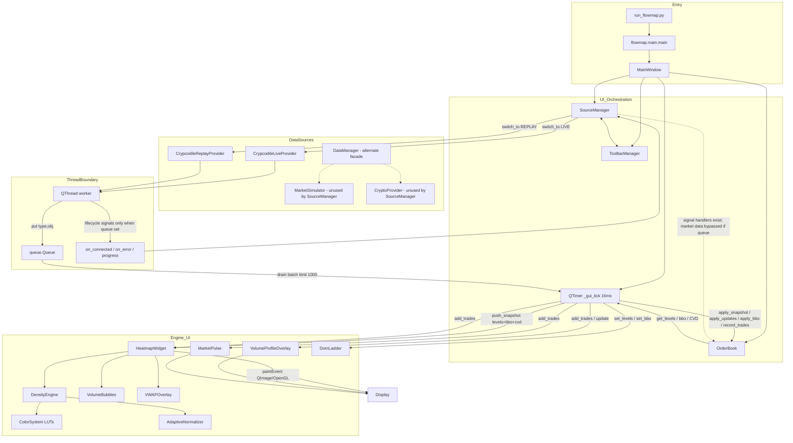

# R01 — FlowMap Architecture Map (Phase 1)

**Agent:** R01  
**Scope:** Standalone FlowMap at `/Users/nazmi/flowmap`  
**Version:** `0.1.0` (`flowmap/__init__.py`, `setup.py`)  
**Date:** 2026-07-13  

---

## 1. Özet (Executive Summary)

FlowMap, Bookmap-tarzı **order flow / liquidity heatmap** masaüstü uygulamasıdır.  
Stack: **Python 3.10+ · PyQt6 · NumPy · sortedcontainers · (opsiyonel) Crypcodile / CCXT**.

**Aktif runtime path** (şu an UI’da):

```
Crypcodile Live | Replay
    → worker thread + queue.Queue
    → MainWindow._gui_tick (~16 ms)
    → OrderBook
    → HeatmapWidget.push_snapshot → DensityEngine
    → paintEvent / overlays (VP, Pulse, bubbles, DOM)
```

**Paralel / legacy path’ler** de mevcuttur (`DataManager`, `MarketSimulator`, `CryptoProvider`, `BookmapHeatmap` renderer) — UI `SourceManager` bunları şu an birincil path olarak kullanmıyor.

---

## 2. Entry Points

| Entry | Path | Rol |
|---|---|---|
| Launcher | `run_flowmap.py` | PyQt6/numpy yoksa `.venv` python’a re-exec; `flowmap.main.main()` |
| App main | `flowmap/main.py` | `QApplication` + Fusion style + `MainWindow().show()` + `app.exec()` |
| Console script | `setup.py` → `flowmap=flowmap.main:main` | pip install sonrası CLI |
| Package meta | `flowmap/__init__.py` | `__version__ = "0.1.0"` |

**Default boot (`MainWindow.__init__`):**

- Symbol: `binance-spot:SOLUSDT`
- Data dir: `/Users/nazmi/data`
- `SourceManager.data_source` default: **`CRYPCODILE_LIVE`**
- `switch_to(data_source)` hemen çağrılır
- `QTimer.singleShot(500, toggle_simulation)` → auto-start

---

## 3. Version & Dependencies

### 3.1 `requirements.txt` (runtime pin list)

| Package | Constraint |
|---|---|
| PyQt6 | ≥6.5.0 |
| numpy | ≥1.24.0 |
| pyqtgraph | ≥0.13.0 |
| sortedcontainers | ≥2.4.0 |
| ccxt | ≥4.0.0 |
| aiohttp | ≥3.8.0 |
| websocket-client | ≥1.6.0 |

### 3.2 `setup.py`

- **name:** `flowmap`, **version:** `0.1.0`, **python_requires:** `≥3.10`
- **install_requires:** PyQt6, numpy, pyqtgraph, sortedcontainers
- **extras_require:**
  - `crypto`: ccxt, aiohttp
  - `all`: ccxt, aiohttp, websocket-client
- **Not listed but used:** Crypcodile (external, optional import for live/replay), scipy (optional import path inside `HeatmapWidget.rebuild_heatmap`)

---

## 4. Package Structure

```
flowmap/
├── run_flowmap.py                 # launcher
├── setup.py / requirements.txt
├── plugins/example_indicator.py   # user plugins (repo root)
└── flowmap/                       # installable package
    ├── __init__.py                # v0.1.0
    ├── main.py                    # QApplication entry
    ├── core/                      # primitives + order book + config + event bus
    │   ├── __init__.py            # Side, Level2Snapshot/Update, Trade, BBO, BookLevel
    │   ├── order_book.py          # L2 book (SortedDict)
    │   ├── config.py              # AppConfig dataclass
    │   └── events.py              # EventBus singleton (underused)
    ├── data/                      # providers
    │   ├── base.py                # DataProvider (pyqtSignal interface)
    │   ├── manager.py             # DataManager (proxy; UI uses SourceManager instead)
    │   ├── simulator.py           # MarketSimulator
    │   ├── crypto.py              # CCXT WS / REST CryptoProvider
    │   ├── crypcodile_replay.py   # DuckDB/parquet replay
    │   ├── crypcodile_live.py     # live exchange connectors via Crypcodile
    │   └── config.py              # EXCHANGE_CONFIG
    ├── engine/                    # pure NumPy heatmap engine
    │   ├── density_engine.py
    │   ├── color_system.py
    │   ├── normalizer.py
    │   └── config.py              # EngineConfig
    ├── ui/                        # PyQt6 widgets
    │   ├── main_window.py         # orchestration + GUI timer drain
    │   ├── source_manager.py      # provider lifecycle + queue
    │   ├── toolbar_manager.py
    │   ├── heatmap_widget.py      # primary renderer host
    │   ├── bubbles.py
    │   ├── pulse.py               # MarketPulse (CVD panel)
    │   ├── price_chart.py         # present but not in current central layout
    │   ├── theme.py
    │   ├── heatmap/               # color_schemes + legacy BookmapHeatmap
    │   ├── overlays/              # volume_profile, vwap, cvd
    │   ├── dom/dom_ladder.py
    │   ├── panels/features_dialog.py
    │   ├── bubbles/               # empty dir
    │   └── tape/                  # empty dir
    ├── plugins/                   # PluginAPI + loader
    ├── indicators/                # empty placeholder
    ├── trading/                   # empty placeholder
    └── utils/                     # empty placeholder
```

**README drift:** README hâlâ `core/types.py` ve sim/CCXT-centric tree anlatıyor; gerçek primitives `core/__init__.py` içinde. UI orchestration `SourceManager` + queue odaklı.

---

## 5. Architecture Diagram (Mermaid)



---

## 6. Data Flow (Critical Path)

### 6.1 End-to-end pipeline

| Step | Component | Ne yapar |
|---|---|---|
| 1 | Provider worker (QThread) | Crypcodile record → FlowMap types (`Level2Snapshot`, `Level2Update`, `Trade`, `BBO`) |
| 2 | `queue.Queue` | `("snapshot"\|"update"\|"trade"\|"bbo", obj)` — thread-safe batching |
| 3 | `MainWindow._gui_tick` | max 1000 msg drain; snapshot gelirse önceki update/bbo batch clear |
| 4 | `OrderBook` | `apply_snapshot` / `apply_updates` / `apply_bbo` / `record_trades` |
| 5 | Trade side-effects | `HeatmapWidget.add_trades`, `MarketPulse.add_trades`, `VolumeProfileOverlay.add_trades` |
| 6 | Snapshot to UI | `levels = order_book.get_levels()`, `bbo`, `cvd = get_volume_delta()` |
| 7 | `HeatmapWidget.push_snapshot` | history append; auto_follow ise `DensityEngine.push_snapshot` |
| 8 | `DensityEngine` | tick detect, center price, scroll buffer, vectorized row map (`np.maximum.at`), normalize, LUT color |
| 9 | Paint / overlays | `paintEvent` → buffer → QImage; bubbles, BBO tags, LLT/iceberg/stops; VP/Pulse/DOM refresh |

### 6.2 Queue vs Signal duality (önemli)

Crypcodile workers (`crypcodile_replay` / `crypcodile_live`):

- **`queue is not None`:** sadece `queue.put(...)` — market data **signal emit edilmez**
- **`queue is None`:** `sig_snapshot/update/trade/bbo.emit`

`SourceManager` her provider’a `queue=self._queue` verir ve yine de:

```text
provider.on_snapshot → OrderBook.apply_snapshot
provider.on_update   → OrderBook.apply_update
provider.on_trade    → OrderBook.record_trade
provider.on_bbo      → pass  (!!)
```

**Sonuç:** Aktif path’te market data **yalnızca queue → `_gui_tick`** üzerinden akar. Signal handler’lar queue varken dead path; queue yoksa fallback.

### 6.3 OrderBook → DensityEngine mapping

```text
OrderBook._bids / _asks (SortedDict)
  → get_levels() → list[BookLevel]  (price, bid_size, ask_size, trade_*, delta)
  → HeatmapWidget.push_snapshot
      → pre-parse bid/ask numpy arrays
      → DensityEngine.push_snapshot(levels, bbo, vis_rows, bid_prices/values, ask_prices/values, cvd, ts)
          → center_price_ticks (immediate | deadband | ema | smooth_deadband)
          → buffer scroll left + clear rightmost column
          → _draw_column: price → row via render_tick_size; ColorSystem.BOOKMAP_*_LUT
```

### 6.4 GUI frame rate

- `_gui_timer.start(16)` ≈ **62.5 Hz** ceiling for book→engine push
- Paint is demand-driven (`update()` after push)
- OpenGL backend default when not in test/verify/benchmark argv; override: `FLOWMAP_RENDERER=cpu|opengl`

---

## 7. Module Responsibilities

### 7.1 `core/`

| Module | Responsibility |
|---|---|
| `__init__.py` | Market primitives: `Side`, `Level2Snapshot`, `Level2Update`, `Trade`, `BBO`, `Quote`, `BookLevel`, helpers |
| `order_book.py` | L2 book: snapshot/delta/BBO, trade absorption, prune ±15% mid, callbacks `on_update/on_trade/on_bbo` |
| `config.py` | `AppConfig` master settings (engine + display + sim) — **kısmen wired**; çoğu runtime ayar UI/engine’de |
| `events.py` | `EventBus` + `EventType` singleton — **UI’da fiilen kullanılmıyor** |

### 7.2 `data/`

| Module | Class | Role |
|---|---|---|
| `base.py` | `DataProvider` | Abstract QObject: `on_snapshot/update/trade/bbo/connected/disconnected/error` |
| `manager.py` | `DataManager` | Provider factory + signal proxy (sim/CCXT) — **MainWindow kullanmıyor** |
| `simulator.py` | `MarketSimulator` | Synthetic L2 + trades via QTimer |
| `crypto.py` | `CryptoProvider`, `_WsWorker` | CCXT WS / REST poll; optional queue |
| `crypcodile_replay.py` | `CrypcodileReplayProvider`, `_ReplayWorker` | DuckDB parquet replay, speed, pause, auto-loop |
| `crypcodile_live.py` | `CrypcodileLiveProvider`, `_LiveWorker` | Live connectors via Crypcodile |
| `config.py` | `EXCHANGE_CONFIG` | Exchange defaults for CCXT path |

### 7.3 `engine/`

| Module | Class | Role |
|---|---|---|
| `density_engine.py` | `DensityEngine` | Rolling RGBA buffer, centering, column draw, histories |
| `color_system.py` | `ColorSystem` | Precomputed bid/ask LUTs |
| `normalizer.py` | `AdaptiveNormalizer` | EMA of p98 sizes → intensity |
| `config.py` | `EngineConfig` | decay, refs, centering, ticks_per_row |

### 7.4 `ui/`

| Module | Class | Role |
|---|---|---|
| `main_window.py` | `MainWindow` | Layout, docks, sidebar, timers, queue drain, wiring |
| `source_manager.py` | `SourceManager`, `DataSource` | Live/Replay switch, provider lifecycle, queue owner |
| `toolbar_manager.py` | `ToolbarManager` | Symbol, Start/Stop, Sidebar |
| `heatmap_widget.py` | `HeatmapWidget` | Engine host, paint, zoom/scroll, trades, LLT/iceberg/stops |
| `bubbles.py` | `VolumeBubbles`, `Bubble` | Trade volume circles |
| `pulse.py` | `MarketPulse` | CVD area chart + sweeps |
| `overlays/volume_profile.py` | `VolumeProfileOverlay` | COB / CVP / SVP |
| `overlays/vwap.py` | `VWAPOverlay` | VWAP line on heatmap |
| `overlays/cvd.py` | `CVDOverlay` | Alternate CVD widget (MarketPulse primary) |
| `dom/dom_ladder.py` | `DomLadder` | Numeric depth ladder dock |
| `price_chart.py` | `PriceChart` | Shared-time chart (README top-22%; **current layout heatmap-centric**) |
| `heatmap/heatmap_renderer.py` | `BookmapHeatmap` | **Legacy** alternate heatmap widget |
| `theme.py` | `Colors`, `Fonts`, stylesheet | Dark theme tokens |
| `panels/features_dialog.py` | Features UI | Marketing/features dialog |

### 7.5 `plugins/`

| Module | Role |
|---|---|
| `plugin_api.py` | `PluginAPI`, `AddonState`, indicator lines / annotations |
| `loader.py` | discover/load/register plugins from directory |

**Not:** MainWindow boot path’inde plugin auto-load görünmüyor — API var, wiring zayıf.

---

## 8. Major Classes (catalog)

| Layer | Class | Notes |
|---|---|---|
| App | `MainWindow` | Owns OrderBook, SourceManager, HeatmapWidget, timers |
| Data | `DataProvider` | Signal contract |
| Data | `CrypcodileReplayProvider` | Active replay source |
| Data | `CrypcodileLiveProvider` | Active live source (default) |
| Data | `MarketSimulator` | Secondary/unused in SM |
| Data | `CryptoProvider` | Secondary/unused in SM |
| Data | `DataManager` | Alternate orchestration |
| Core | `OrderBook` | Canonical book state |
| Engine | `DensityEngine` | Heatmap buffer math |
| Engine | `AdaptiveNormalizer` | Color scaling |
| UI | `HeatmapWidget` | Largest module; all visual layers |
| UI | `SourceManager` | Source + queue |
| UI | `VolumeProfileOverlay` | Right rail |
| UI | `MarketPulse` | Bottom CVD |
| UI | `DomLadder` | Dock |
| Plugins | `PluginAPI` | Extensibility surface |

---

## 9. Signals / Slots / Queues / Callbacks

### 9.1 Thread-safe queue (primary market data)

```text
SourceManager._queue : queue.Queue
  messages: ("snapshot", Level2Snapshot)
            ("update", Level2Update)
            ("trade", Trade)
            ("bbo", BBO)
Consumer: MainWindow._gui_tick
```

### 9.2 Provider → SourceManager signals (lifecycle + legacy data)

| Signal | Handler | Effect |
|---|---|---|
| `on_snapshot` | `_on_provider_snapshot` | `OrderBook.apply_snapshot` (queue varken genelde fire etmez) |
| `on_update` | `_on_provider_update` | `OrderBook.apply_update` |
| `on_trade` | `_on_provider_trade` | `OrderBook.record_trade` |
| `on_bbo` | `_on_provider_bbo` | **`pass`** — intentional no-op |
| `on_connected` | `_on_provider_connected` | `_running=True`, toolbar Start→Stop |
| `on_disconnected` | `_on_provider_disconnected` | stop UI state |
| `on_error` | `_on_provider_error` | status bar |
| `replay_progress` | `_on_replay_progress` | status % |

### 9.3 OrderBook plain callbacks (not Qt)

| Callback | Wired by | Handler |
|---|---|---|
| `on_trade` | `MainWindow._wire_callbacks` | `_on_trade` → heatmap/pulse/VP (**batch path temporarily nulls this**) |
| `on_bbo` | `_wire_callbacks` | `_on_bbo` → **`pass`** |
| `on_update` | not wired by MainWindow | — |

### 9.4 HeatmapWidget signals

| Signal | Consumer |
|---|---|
| `price_hovered` | status bar price |
| `row_height_changed` | VP / zoom sync |
| `column_width_changed` | timeframe UI |
| `view_changed` | VP visible prices sync |
| `iceberg_detected` | iceberg dock table |
| `price_clicked` | (available) |

### 9.5 Timers

| Timer | Interval | Slot |
|---|---|---|
| `_gui_timer` | 16 ms | `_gui_tick` (queue drain + render push) |
| `_sim_timer` | connected | `_sim_tick` → **`pass`** (dead) |
| Auto-start | 500 ms once | `SourceManager.toggle_simulation` |

### 9.6 EventBus (`core/events.py`)

- Types: `SOURCE_CHANGED`, `SIMULATION_*`, `SYMBOL_CHANGED`, `DECAY_CHANGED`, `ZOOM_CHANGED`, `PROVIDER_*`, `ERROR`
- Main-thread dispatcher via `pyqtSignal`
- **Bug-hunt note:** bus is largely unused by MainWindow/SourceManager; dual event systems risk.

---

## 10. UI Layout Topology

```text
MainWindow
├── ToolBar (ToolbarManager): Symbol | Start/Stop | Sidebar
├── Central: QSplitter horizontal
│   ├── Left grid
│   │   ├── HeatmapWidget (r0c0)
│   │   ├── VolumeProfileOverlay (r0c1)
│   │   ├── MarketPulse (r1c0)
│   │   └── spacer (r1c1)
│   └── Sidebar tabs: VISUALS | INDICATORS | SETTINGS
├── Docks (right)
│   ├── DOM Ladder (hidden by default)
│   ├── Significant Icebergs
│   └── Large Lot Tracker
└── StatusBar
```

---

## 11. File Complexity / LOC Risk Ranking

LOC yaklaşık (source line estimates from file ends / structure; ±5%).

| Rank | File | ~LOC | Complexity drivers | Risk |
|---|---|---:|---|---|
| 1 | `ui/heatmap_widget.py` | **~2350** | Engine glue, paint, rebuild, mouse/zoom, LLT/iceberg/stops, OpenGL/CPU, history rebuild | **CRITICAL** |
| 2 | `ui/main_window.py` | **~1176** | UI construction + data pipeline in same class | **HIGH** |
| 3 | `data/crypcodile_replay.py` | **~920+** | Thread worker, DuckDB time range, record mapping, speed control | **HIGH** |
| 4 | `data/simulator.py` | **~780+** | Synthetic microstructure; currently unused by SM | MEDIUM |
| 5 | `engine/density_engine.py` | **~587** | Centering modes, vectorized column draw, buffer roll | **HIGH** |
| 6 | `data/crypto.py` | **~535** | WS + REST dual path | MEDIUM |
| 7 | `ui/source_manager.py` | **~508** | Source switch, symbol map, queue ownership | **HIGH** |
| 8 | `plugins/plugin_api.py` | **~497** | Extensibility surface, lightly integrated | LOW–MED |
| 9 | `core/order_book.py` | **~469** | Correctness of book/trade absorption | **HIGH** |
| 10 | `ui/pulse.py` | **~450+** | CVD rendering + sweeps | MEDIUM |
| 11 | `ui/overlays/volume_profile.py` | **~400+** | COB/CVP/SVP alignment with heatmap rows | **HIGH** |
| 12 | `ui/dom/dom_ladder.py` | **~400+** | Interaction + paint | MEDIUM |
| 13 | `ui/heatmap/heatmap_renderer.py` | ~300+ | Legacy parallel implementation | MEDIUM (drift) |
| 14 | `data/crypcodile_live.py` | **~278** | Live worker lifecycle | HIGH (correctness) |
| 15 | `ui/bubbles.py` | **~240+** | Trade aggregation drawing | MEDIUM |

Empty / placeholder packages: `indicators/`, `trading/`, `utils/`, `ui/tape/`, `ui/bubbles/` dir.

---

## 12. Critical Paths (for bug-hunt prioritization)

### P0 — Live/Replay correctness

1. Worker record → type conversion (`_dispatch_record` family)
2. Queue batching rules (snapshot clears pending updates/bbos)
3. `OrderBook.apply_*` + crossed-book prune + trade absorption fuzzy match (`abs(k-price) < 0.00005`)
4. `_gui_tick` only runs when `_source.running`
5. BBO: queue applies `apply_bbo`; signal handler is no-op

### P0 — Visual correctness

1. `HeatmapWidget.push_snapshot` ↔ `DensityEngine` centering / tick_size / ticks_per_row
2. `rebuild_heatmap` full history re-raster (heavy; resize/zoom path)
3. Row alignment: Heatmap ↔ VolumeProfile ↔ price axis
4. Trade overlays vs column scroll_offset / history index

### P1 — Performance

1. Drain limit 1000/frame under burst live
2. `history_width=10000` in HeatmapWidget engine init
3. paintEvent + static cache invalidation
4. OpenGL vs CPU backend differences

### P1 — Lifecycle / state

1. `switch_to` / `stop_current` / symbol change resets
2. Queue drain on stop (stale msg prevention)
3. Replay auto-loop in worker finally/restart path
4. Hardcoded default data dir `/Users/nazmi/data`

### P2 — Dead / dual code paths

1. `DataManager` vs `SourceManager`
2. Signal market-data handlers vs queue-only emit
3. `MarketSimulator` / `CryptoProvider` not in `DataSource` enum
4. `BookmapHeatmap` vs `HeatmapWidget`
5. `EventBus` unused
6. `_sim_tick` / `_on_bbo` empty
7. `CVDOverlay` vs `MarketPulse`
8. `PriceChart` not in active central layout

---

## 13. Risk Hotspots (ranked)

| Priority | Hotspot | Why |
|---|---|---|
| **R1** | `HeatmapWidget` + `DensityEngine` | Highest LOC; view transforms, rebuild, paint race with data push |
| **R2** | `MainWindow._gui_tick` batch apply | Correctness of ordering (snapshot vs update vs trade vs bbo) |
| **R3** | `OrderBook` trade absorption + prune | Fuzzy price match; volume double-count risk; depth=3000 |
| **R4** | Crypcodile workers + queue | Threading, reconnect, replay speed, incomplete disconnect |
| **R5** | Dual architecture (queue/signals, SM/DM) | Confusion, half-wired handlers, future double-apply if queue removed inconsistently |
| **R6** | Overlay alignment (VP / Pulse / VWAP) | Depends on private engine fields (`center_price_ticks`, `tick_size`) |
| **R7** | Symbol-specific hardcodes in `update_thresholds_for_symbol` | SOL/ETH/BTC magic numbers for thresholds & refs |
| **R8** | Plugin system orphaned | Load path not in boot; partial integration |
| **R9** | Config fragmentation | `AppConfig` vs `EngineConfig` vs UI spinboxes — no single source of truth at runtime |
| **R10** | Debug noise | `SourceManager._running` setter prints stack to stderr |

---

## 14. Connection Map (quick reference)

```text
run_flowmap.py
  └─ flowmap.main.main()
       └─ MainWindow
            ├─ OrderBook(symbol, depth=3000)
            ├─ ToolbarManager ⟷ SourceManager
            │     ├─ queue.Queue
            │     ├─ CrypcodileLiveProvider(queue=...)
            │     └─ CrypcodileReplayProvider(queue=...)
            ├─ HeatmapWidget
            │     ├─ DensityEngine
            │     ├─ VolumeBubbles
            │     └─ VWAPOverlay
            ├─ VolumeProfileOverlay(heatmap, order_book)
            ├─ MarketPulse(heatmap)
            ├─ DomLadder (dock)
            ├─ _gui_timer → _gui_tick
            │     drain queue → OrderBook → heatmap/pulse/VP/DOM
            └─ OrderBook.on_trade → (single-trade path; batch nulls it)
```

---

## 15. Insights for later phases

1. **Single choke point for market data into the book is `_gui_tick`** when queue is used — ideal place for instrumentation and invariant checks.
2. **HeatmapWidget is the god-object of the UI layer**; split candidates: paint, interaction, detectors (LLT/iceberg/stops), history rebuild.
3. **Dead code paths inflate bug surface**: treat `DataManager`/`Simulator`/`BookmapHeatmap`/`EventBus` as either wire-up or quarantine in Phase 2.
4. **README architecture is stale** relative to Live-default + queue pipeline.
5. **Normalizer naming mismatch:** class is `AdaptiveNormalizer` but module docstring still describes fixed-ref-only behavior — behavior is adaptive EMA p98.

---

## 16. Sources inspected

- `/Users/nazmi/flowmap/README.md`
- `/Users/nazmi/flowmap/run_flowmap.py`
- `/Users/nazmi/flowmap/flowmap/main.py`
- `/Users/nazmi/flowmap/flowmap/__init__.py`
- `/Users/nazmi/flowmap/requirements.txt`, `setup.py`
- Package tree under `/Users/nazmi/flowmap/flowmap/`
- Core: `order_book.py`, `events.py`, `config.py`, `core/__init__.py`
- Data: `base.py`, `manager.py`, `crypcodile_*.py`, `crypto.py`, `simulator.py`
- Engine: `density_engine.py`, `color_system.py`, `normalizer.py`, `config.py`
- UI: `main_window.py`, `source_manager.py`, `heatmap_widget.py`, `toolbar_manager.py`, overlays/dom/pulse
- Plugins: `plugin_api.py`, `loader.py`
- Inventory: `bug_hunt/phase1_research/FILE_INVENTORY.txt`

---

*End of R01 architecture report.*
